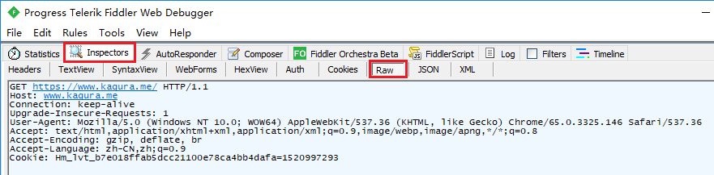
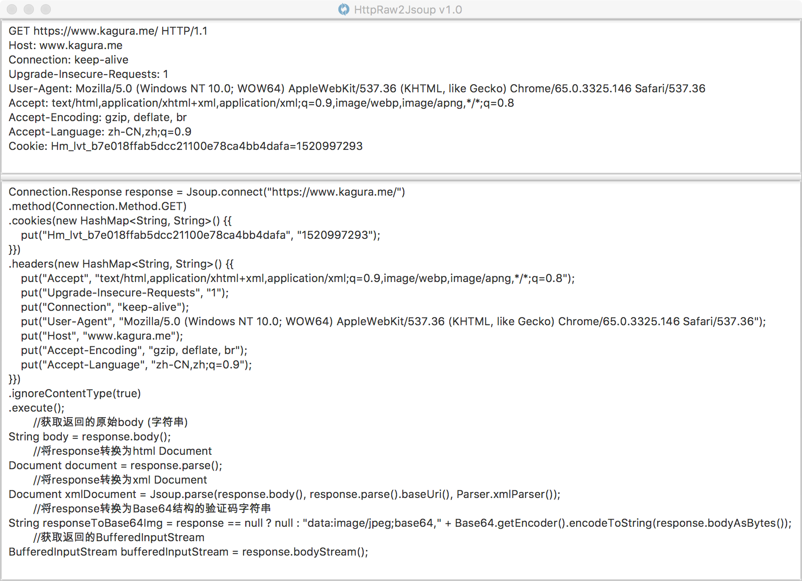

# HttpRaw2Jsoup

#### 本工具可以帮你把原生http请求转换成Jsoup请求代码,方便爬虫编写，接口测试。
#### 直接粘贴原始请求即可生成代码并自动复制到剪切板，支持跨平台。
### 如何使用？
#### 下载[HttpRaw2Jsoup-1.2.jar](https://github.com/KingFalse/HttpRaw2Jsoup/releases/download/v1.2/HttpRaw2Jsoup-1.2.jar)，双击运行即可使用
### Fiddler中如何找到原始http请求:

### 示例截图：

